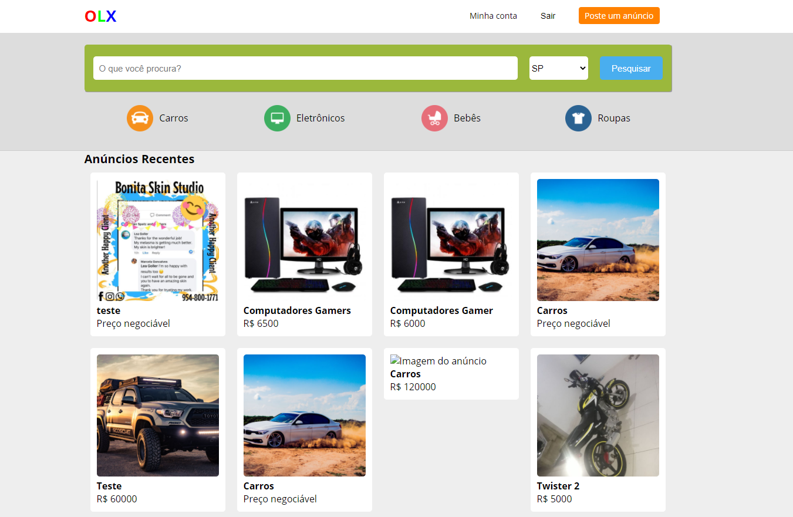
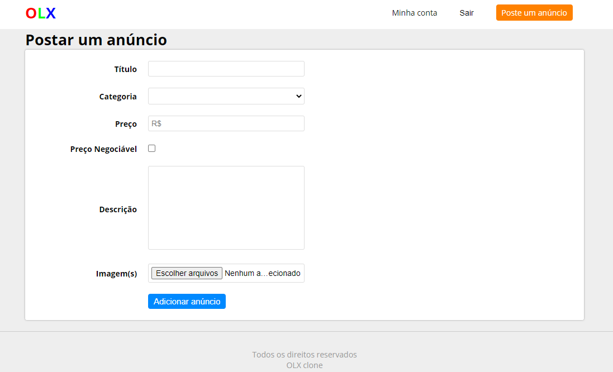
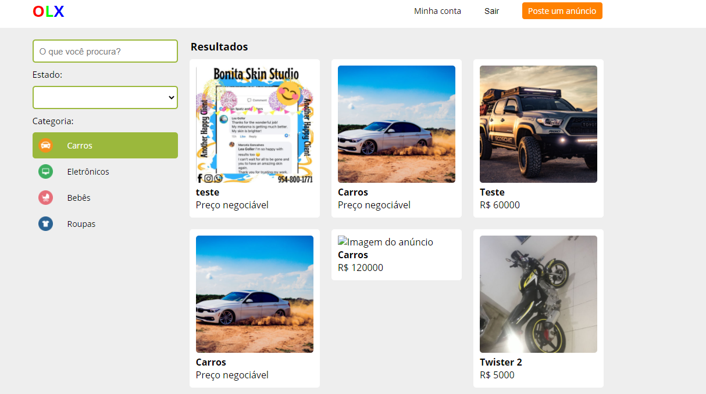

<h1 align="center">OLX-Clome</h1>
<h4 align="center">OLX Clone, made with pure Javascript.</h4>

<em>for educational purposes</em>

### Topics practiced
- React Immutability
- React Hooks
- Styled Components
- React Routing
- Custom Routes
- Responsiveness
- Forms Treatment
- Flexbox
 

